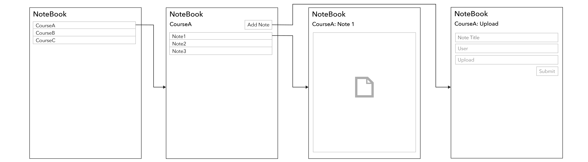

# Design and Planning Document

### UML Diagram

### Wireframe Diagram

### Iteration Backlog

* As a student, I want to view notes for a course.
* As a student, I want to upload notes for a course.

### Tasks
* Create database(s) holding the courses and reviews.
* Create classes for courses and note, and decide how they are to interact.
* Create a UI so that users can interact with the program by looking at and uploading note.
* Link back-end with front-end. 
