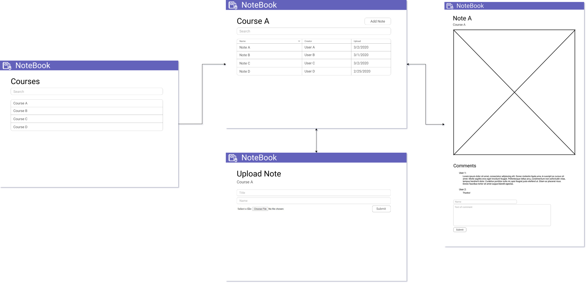

# Iteration 2 Design and Planning Document

### UML Diagram

### Wireframe Diagram

### Iteration Backlog

* As a student, I want to view notes for a course.
* As a student, I want to upload notes for a course.
* As a studemt, I want to be able to comment on notes. 
* As a student, I want to be able to search and sort notes. 

### Tasks
* Add comment class.
* Implement sorting and searching ability.
* Modularize the main methods in ApiServer and WebServer.
* Add exception Handlers.
* Class and API testing.
* Improve front end visuals.
