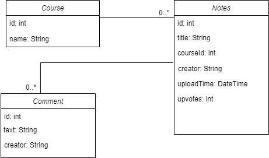

# Iteration 3 Design and Planning Document

### UML Diagram

### Wireframe Diagram

### Iteration Backlog
* As a student I want to be able to search all notes for a course for mentions of specific topics so I can easily find information.
* As a student I want to be able to sort notes using additional criteria such as date, popularity, rating, etc.
* As a student I want to upvote notes that I think are useful so other students will find them.
* As a student I want to be able to edit notes in Markdown or LaTeX.

### Tasks
* Extend searching to include text inside of text notes, not just title.
* Extend sorting to allow sorting by metadata that shouws up in additional columns like in a filesystem.
* Add the ability to like a note.
* Add TeX capability to writing notes in-browser (may be a stretch, talk about this on Thurs)
* Style note view, increase pdf viewer size/zoom, and style comments.
* Implement replies to comments.
