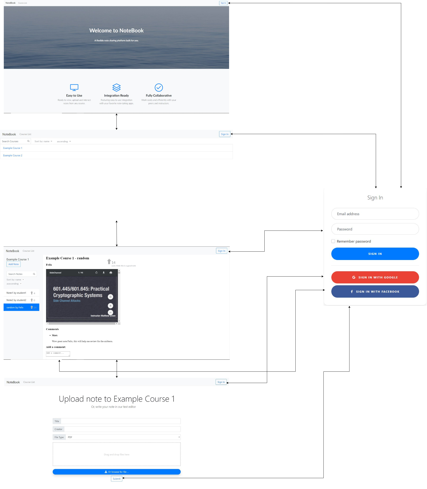

# Iteration 4 Design and Planning Document

### UML Diagram

### Wireframe Diagram

### Iteration Backlog
* User stories here

### Tasks
* Modify the note text submission area to accept Markdown and LaTeX.
* Actually implement log-in system.
* Integrate Google log-in
* Make the notes sidebar collapsable.
* Style the comments hierarchically.
* Add "search by" filters for notes.
* Pop-up the signin page instead of redirecting the user when they try to add a comment or note without logging in.
* Improve OCR for handwritten notes.
* Make the app reactive for mobile devices.
