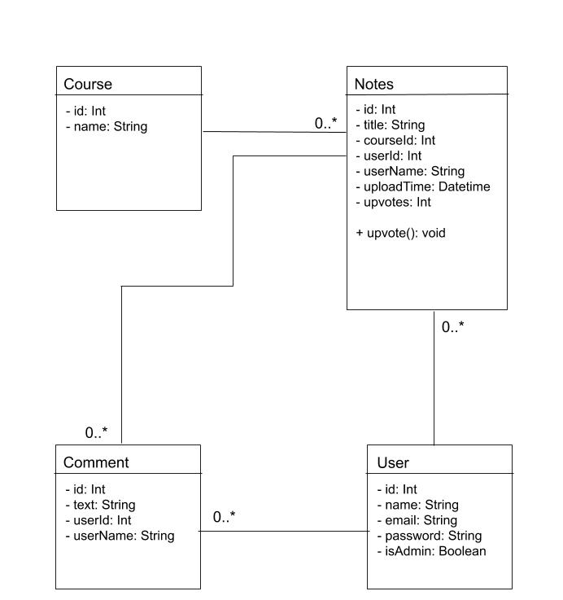

# Iteration 4 Design and Planning Document

### UML Diagram

### Wireframe Diagram

### Iteration Backlog
Note that both of these stories are in the "Nice to have" section of our RSD. We're still doing a lot of work on our "Must have" stories in this iteration, but most of them are already technically done, they just need polishing. See our Tasks list for details.
* As a student I want to be able to edit notes in Markdown or LaTeX.
* As a student I want there to be text recognition so I can search inside of handwritten notes.

### Tasks
* Modify the note text submission area to accept Markdown and LaTeX.
* Actually implement log-in system.
* Integrate Google log-in
* Make the notes sidebar collapsable.
* Style the comments hierarchically.
* Add "search by" filters for notes.
* Pop-up the signin page instead of redirecting the user when they try to add a comment or note without logging in.
* Improve OCR for handwritten notes.
* Make the app reactive for mobile devices.

### Retrospective
This iteration we focused on cleaning up the user interface, an authentication system, and a few "nice to have's". We had some difficulty implementing handwritten text recognition, but everything else went relatively smoothly (after some design changes). We decided to do authentication fully through Google's API for sake of security and smooth implementation. Some reformatting of the front end mode the app look better and be fully functional on mobile as well (reactive). We also added functionality to search by note information/metadata. We accomplished almost everything we set out to do this iteration, however we've noticed some bugs to fix next iteration, and have some further UI changes to make as well as some code clean-up. Next iteration we will focus on managing our time a little better and collaberating among each other to solve some of the more difficult challenges.   
