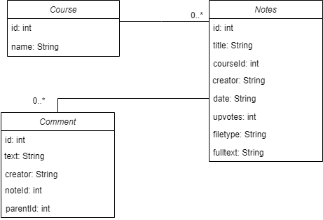
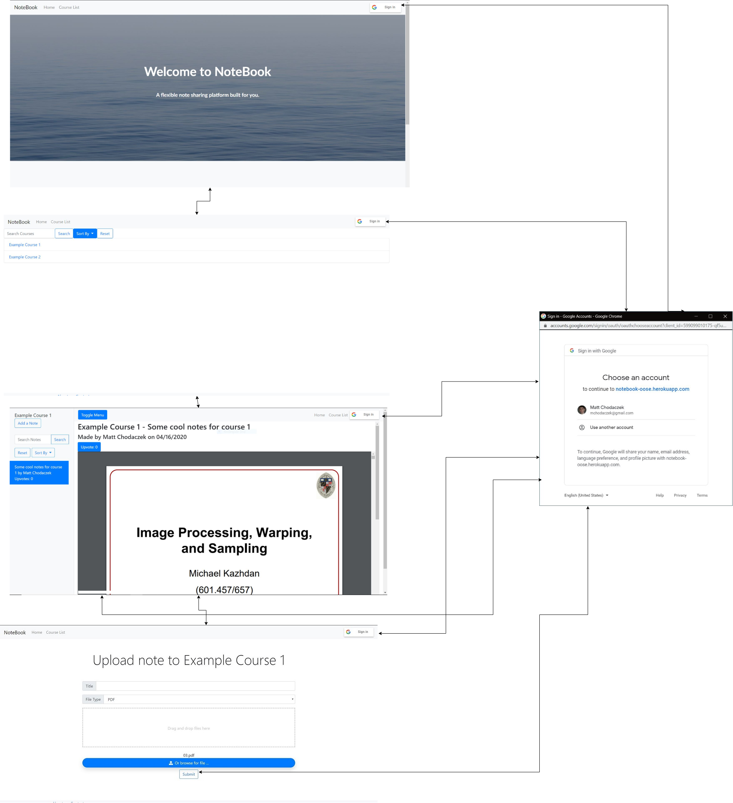

# Iteration 5 Design and Planning Document

### UML Diagram

### Wireframe Diagram

### Iteration Backlog

### Tasks
* Clean up the codebase.
* Fix automatic upvote population in sidebar
* Fix sign-in/sign-out buttons not changing automatically in some cases.
* Add favicon.
* Do UI/UX styling pass.
* Clean up DB/demo data.
* Fix note title overflow in sidebar.
* Add ability to edit/delete comments.
* Email Subscription to courses
* Social media integration for sharing notes on Facebook and Twitter.

### Final Retrospective
The past five iterations have been challenging, but interesting. The biggest non-coding challenges we ran into were having to adjust to working from home, staying motivated during the pandemic, and operating as a team without having some sort of internal structure. This all combined to make communication and determining responsibility fairly difficult in some cases. Coding-wise, our biggest hurdles were getting everyone up-to-speed on the variety of technologies we're using, such as AJAX, Tessarect, and gapi.

We accomplished almost all of our "must-have" user stories from the original project proposal, except for the proposed admin features. While they're technically there, they need a lot more polish. We also accomplished one of our "nice-to-have" stories. We also added some additional things, like email subscriptions to courses and social media integration to share notes on Facebook and Twitter.

If we started over, we would try to do a better job of researching competitors and figure out the best direction for our app that allows us to offer something different. In approaching this project, we focused more on development than direction, and that led to us developing something not entirely unique. Of course, design will evolve throughout the development process, but it's important to establish a unique identity and brand quickly.
